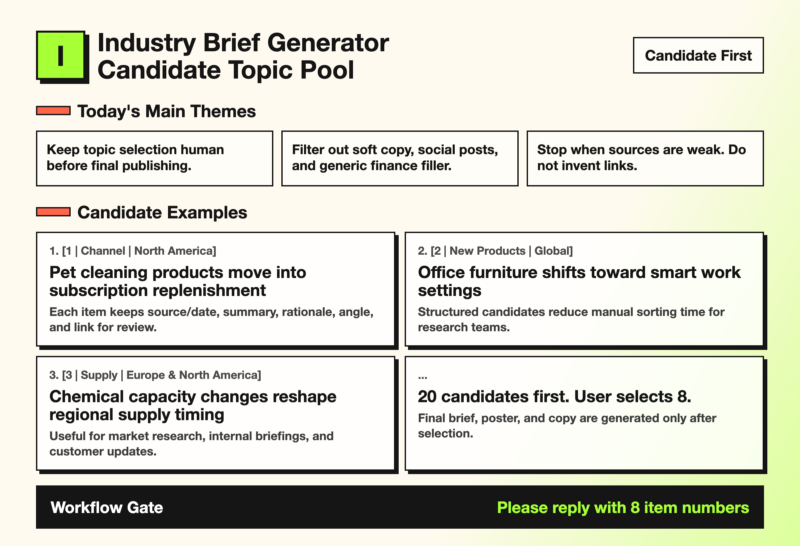

# Industry Brief Generator Plugin

Codex Plugin: a bilingual universal industry news briefing generator.

Enter an industry, market, focus topics, and final use. It generates candidate story topics first. After the user chooses 8, it automatically creates the brief, poster, and channel-ready copy.

This plugin bundles two clearly separated Codex Skills:

- `$industry-brief-generator-english` for English output
- `$industry-brief-generator-chinese` for Chinese output

## Why It Exists

The hardest part of industry briefings is not formatting. It is choosing strong, trustworthy topics.

This plugin separates research from publishing:

1. Generate a sourced candidate pool first.
2. Let the user select the final stories.
3. Generate the final brief, poster, and copy only after selection.

## Demo

### Candidate Pool Preview



### Poster Examples

| Pet Industry | Chemicals |
|---|---|
|  |  |

## Trust Rules

The plugin should not:

- fabricate sources, dates, company actions, or links
- turn social media posts into industry facts
- use generic finance news as filler
- generate the final brief before the user selects final items

If public information is insufficient, it should stop and ask for better sources, a narrower industry boundary, company names, or permission to include older background material.

## English Quick Start

```text
Use $industry-brief-generator-english.

Industry: office supplies
Target market: global
Focus topics: industry news, trade shows, new products, distributor opportunities
Excluded content: social media posts, generic finance, corporate soft copy
Final use: internal brief
Preferred output language: English
```

## 中文快速开始

```text
使用 $industry-brief-generator-chinese。

输入具体行业：办公用品行业
输入具体市场：全球
输入重点关注内容：行业热点新闻、展会、新产品、经销代理机会
输入排除内容：自媒体、企业软文
输入最终用途：公司内部简报
```

## Included Skills

```text
skills/
├── industry-brief-generator-english/
└── industry-brief-generator-chinese/
```

Each skill includes:

- `SKILL.md`
- industry config examples
- candidate pool template
- final brief template
- poster QA checklist
- unsupported-industry protocol

## Good For

- consultants
- market research teams
- international business teams
- content operators
- industry media
- sales and BD teams
- export, distribution, and agency teams

## Repository Structure

```text
.codex-plugin/plugin.json
skills/
assets/
README.md
```

## License

MIT
